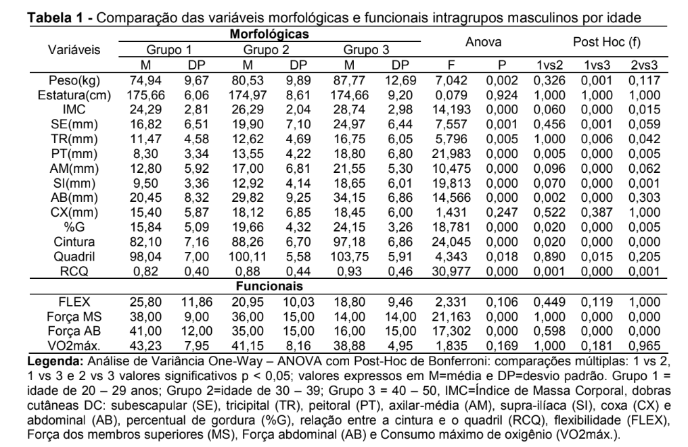
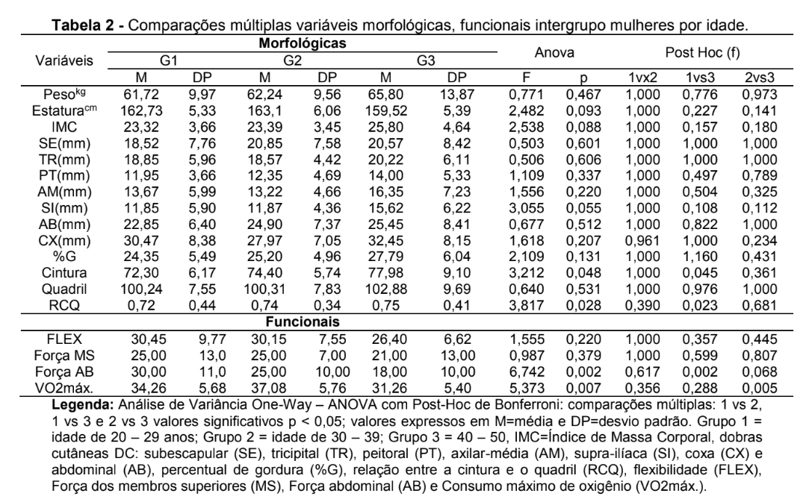

# **CAPÍTULO 1: INTRODUÇÃO**

## **IDENTIFICAÇÃO DO ESTUDO**

::: section-label
Sobre o artigo
:::

::: box-purple
**TÍTULO**

Qualidade de sono e dores musculoesqueléticas em adolescentes: estudo observacional.
:::

**Autores:**
Jéssica Fernanda de Oliveira Lima Batista, Thais Costa de Alencar, Janaína Maria Gomes Fonseca Tolêdo, Kelly Rodrigues Mota, Valdeci Elias dos Santos-Júnior e Mônica Vilela Heimer.

## **MOTIVAÇÃO DA PESQUISA**

::: box-blue
- O sono é uma necessidade fisiológica essencial para o bem-estar da saúde geral do indivíduo.
- A adolescência é um período de maturação do sistema nervoso e mudanças biológicas e sociais, tornando-a mais vulnerável a distúrbios do sono.
- O uso excessivo de tecnologia e mídias pode dificultar a ação reparadora do sono e gerar manifestações dolorosas.
- Estudos sugerem a existência de uma relação entre dores musculoesqueléticas (DME) e qualidade de sono, configurando um processo biopsicossocial.
:::

## **OBJETIVOS**

::: section-label
Meta do estudo
:::

::: box-green
**OBJETIVO GERAL**

Analisar a associação entre a má qualidade de sono e as dores musculoesqueléticas (DME) em adolescentes.
:::

## **A AMOSTRA**

:::: columns

::: {.column width="50%"}
### Coleta
- Amostragem por conglomerados em
duas etapas (escolas e turmas).
- **545 adolescentes** analisados.
- Faixa etária: **11 a 15 anos**.
- Escolas públicas de Recife-PE.
- Entre outubro e novembro de 2018 
:::

::: {.column width="10%"}
:::

::: {.column width="40%"}
### Procedimento
- Amostragem por conglomerados em duas etapas (escolas e turmas).
- Aplicação de questionários em sala de aula sob sigilo.
:::

::::

# **CAPÍTULO 2: METODOLOGIA ESTATÍSTICA**

## **VARIÁVEIS ANALISADAS**

::: section-label
O que foi medido
:::

::: box-orange
- **Desfecho (DME):** Avaliada pelo Questionário Nórdico de Sintomas Osteomusculares (QNSO).
- **Exposição (Sono):** Qualidade medida pelo Índice de Pittsburgh (PSQI) e sonolência pela Escala de Epworth (ESE).
- **Sociodemográficas:** Idade, sexo, escolaridadem situação marital e situação profissional do responsável.
:::

## **MÉTRICAS ADOTADAS**

| Instrumento | Ponto de Corte | Classificação |
|-------------|:--------------:|:-------------:|
| PSQI | > 5 | Má qualidade de sono |
| ESE  | > 10 | Sonolência diurna |

## **TESTES DE ASSOCIAÇÃO**

Para avaliar a associação entre as variáveis categóricas do estudo, foram aplicados:

- **Teste Qui-quadrado de Pearson**.
- **Teste Exato de Fisher** (utilizado quando as frequências esperadas eram baixas).

A decisão estatística baseou-se no nível de significância:
$$\alpha = 0,05 \text{ (ou 5%)} $$

## **TABELAS** {.scrollable}

::: {style="text-align: center"}
{width=50%}
:::

## **TABELAS** {.scrollable}

{width=100%}

{width=100%}

# **CAPÍTULO 3: RESULTADOS**

## **QUALIDADE DO SONO VS. VARIÁVEIS**

| Variável | Valor de $p$ | Associação |
|----------|:----------:|:----------:|
| Horas de sono | $0,043$ | **Significativa**  |
| Presença de dor | $0,347$ | Não Significativa  |
| Sonolência diurna | $0,979$ | Não Significativa  |

::: box-blue
**Interpretação:** A quantidade de horas dormidas por noite está associada à percepção da qualidade do sono do adolescente.
:::

## **DISTÚRBIO DO SONO VS. LOCAL DA DOR**

Abaixo, os locais onde o **Teste Qui-quadrado** revelou dependência significativa entre as variáveis:

::: box-orange
- **Parte superior das costas:** $p = 0,038$.
- **Punhos e mãos:** $p = 0,004$.
:::

 

> A prevalência de dor (geral) na amostra foi de [**87,5%**]{style="color:#e76f51; font-size:1.2em; font-weight:bold;"}

# **CAPÍTULO 4: CONCLUSÃO**

## **SÍNTESE DOS ACHADOS**

::: box-purple
- [x] Associação confirmada entre distúrbios de sono e DME.
- [x] Relação direta entre horas dormidas e qualidade do sono.
- [x] Alta prevalência de má qualidade de sono (66,8%).
:::

## **CONTRIBUIÇÃO PARA A SOCIEDADE**

- **Importância da Estatística:** Os testes de associação permitiram identificar que o sono não é apenas um fator biológico, mas um componente de risco para dores físicas em jovens.
- **Impacto Social:** Os dados sugerem a necessidade de ações educativas sobre a **higiene do sono** e o uso moderado de tecnologias para melhorar a saúde física e qualidade de vida dos adolescentes.